# 🍽️ DigiCraveOS — Software Architecture & UML Blueprint

**AI Restaurant Operating System** · repository: `Lucifer-Newstar/DigiCraveOS`
Prepared for client review · renders natively on **GitHub / GitLab / VS Code / mermaid.live**

This document contains the **software architecture (5 views)** and **all 14 UML 2.5 diagrams** for the product,
written as **Mermaid** so the client can view them on the repo page and the team can edit them like code.
Diagrams are grounded in the **actual MVP source** (controllers, models, routes) — items marked
**«MVP ✔»** or **green** already run in production; everything else is the roadmap described in this blueprint.

| Group | Diagrams |
|---|---|
| Architecture | A1 System Context · A2 Containers (MVP vs target) · A3 Module Landscape · A4 AI & Data Pipeline · A5 Evolution Roadmap |
| Structural UML (7) | U03 Class · U04 Object · U05 Component · U06 Deployment · U07 Package · U08 Composite Structure · U09 Profile |
| Behavioural UML (7) | U01 Use Case · U02 Activity · U10 State Machine · U11 Sequence · U12 Communication · U13 Timing · U14 Interaction Overview |

> ✏️ **To edit:** open any `.mmd` file (in `mermaid/` or `uml/`), or paste a code block below into <https://mermaid.live>.
> 🖼️ Previews: rendered PNGs of every diagram are in `rendered/`.

---

# PART 1 — SOFTWARE ARCHITECTURE (C4-style)

## Architecture 1 · System Context

Who and what DigiCraveOS talks to — the people (actors) and external systems around the product. The system boundary stays stable as modules grow.

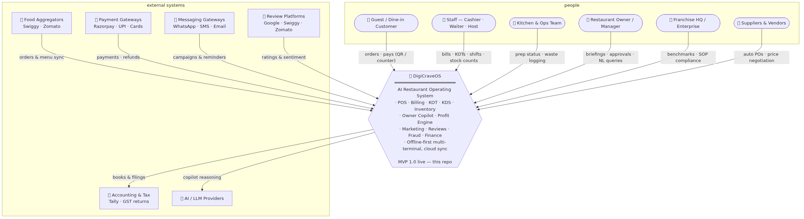

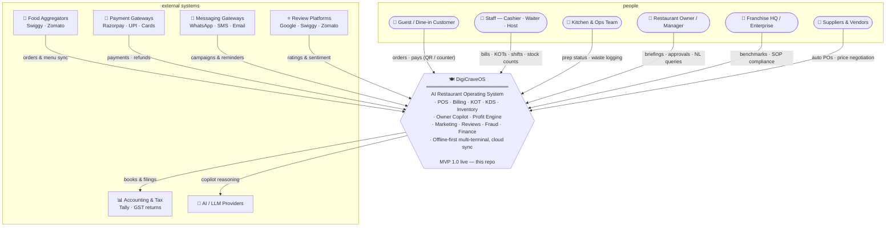
```mermaid
%% A1 — SYSTEM CONTEXT DIAGRAM (C4 Level 1)
%% The people and external systems around DigiCraveOS.
flowchart TB
    subgraph PEOPLE["people"]
        G(["👤 Guest / Dine-in Customer"])
        ST(["👤 Staff — Cashier · Waiter · Host"])
        KS(["👤 Kitchen & Ops Team"])
        OW(["👤 Restaurant Owner / Manager"])
        HQ(["👤 Franchise HQ / Enterprise"])
        SUP(["👤 Suppliers & Vendors"])
    end

    DC{{"🍽️ DigiCraveOS<br>═══════════════════════<br>AI Restaurant Operating System<br>· POS · Billing · KOT · KDS · Inventory<br>· Owner Copilot · Profit Engine<br>· Marketing · Reviews · Fraud · Finance<br>· Offline-first multi-terminal, cloud sync<br><br>MVP 1.0 live — this repo"}}

    subgraph EXT["external systems"]
        AG["🛵 Food Aggregators<br>Swiggy · Zomato"]
        PG["🏦 Payment Gateways<br>Razorpay · UPI · Cards"]
        MSG["💬 Messaging Gateways<br>WhatsApp · SMS · Email"]
        RV["⭐ Review Platforms<br>Google · Swiggy · Zomato"]
        TX["📊 Accounting & Tax<br>Tally · GST returns"]
        LLM["🧠 AI / LLM Providers"]
    end

    G -- "orders · pays (QR / counter)" --> DC
    ST -- "bills · KOTs · shifts · stock counts" --> DC
    KS -- "prep status · waste logging" --> DC
    OW -- "briefings · approvals · NL queries" --> DC
    HQ -- "benchmarks · SOP compliance" --> DC
    SUP -- "auto POs · price negotiation" --> DC

    AG -- "orders & menu sync" --> DC
    PG -- "payments · refunds" --> DC
    MSG -- "campaigns & reminders" --> DC
    RV -- "ratings & sentiment" --> DC
    DC -- "books & filings" --> TX
    DC -- "copilot reasoning" --> LLM
```

## Architecture 2 · Container Architecture

C4 Level 2: deployable containers. Left = the 5 containers in this repository today. Right = the product target — MVP containers **evolve in place, no re-platforming**.

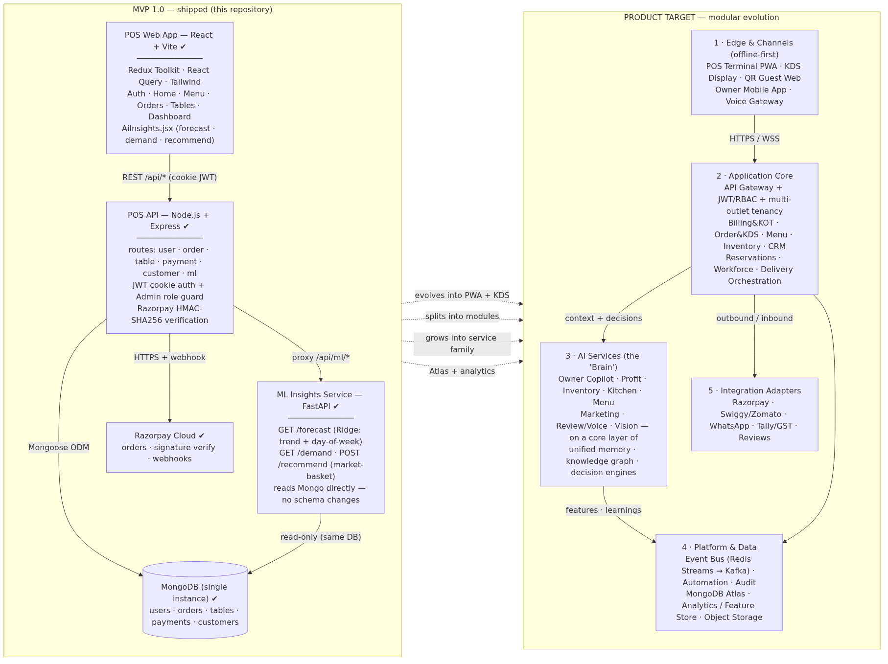

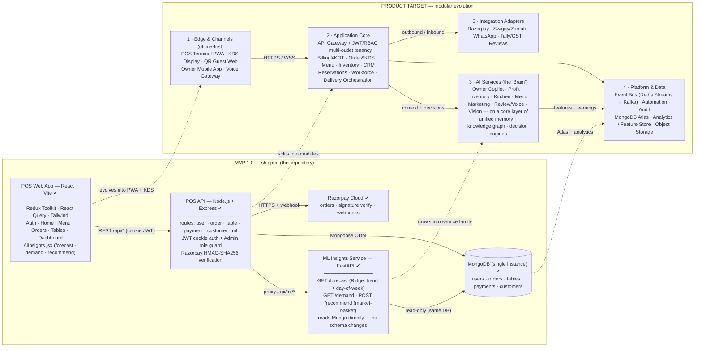
```mermaid
%% A2 — CONTAINER DIAGRAM (C4 Level 2)
%% Left: the five deployable containers in the repo today (green border = built).
%% Right: the product target — MVP containers evolve in place (no rewrite).
flowchart LR
    subgraph MVP["MVP 1.0 — shipped (this repository)"]
        direction TB
        FE["POS Web App — React + Vite ✔<br>──────────────<br>Redux Toolkit · React Query · Tailwind<br>Auth · Home · Menu · Orders · Tables · Dashboard<br>AiInsights.jsx (forecast · demand · recommend)"]
        API["POS API — Node.js + Express ✔<br>──────────────<br>routes: user · order · table · payment · customer · ml<br>JWT cookie auth + Admin role guard<br>Razorpay HMAC-SHA256 verification"]
        MLS["ML Insights Service — FastAPI ✔<br>──────────────<br>GET /forecast (Ridge: trend + day-of-week)<br>GET /demand · POST /recommend (market-basket)<br>reads Mongo directly — no schema changes"]
        MGO[("MongoDB (single instance) ✔<br>users · orders · tables · payments · customers")]
        RZP["Razorpay Cloud ✔<br>orders · signature verify · webhooks"]

        FE -- "REST /api/* (cookie JWT)" --> API
        API -- "proxy /api/ml/*" --> MLS
        API -- "Mongoose ODM" --> MGO
        MLS -- "read-only (same DB)" --> MGO
        API -- "HTTPS + webhook" --> RZP
    end

    subgraph TARGET["PRODUCT TARGET — modular evolution"]
        direction TB
        EDGE["1 · Edge & Channels (offline-first)<br>POS Terminal PWA · KDS Display · QR Guest Web<br>Owner Mobile App · Voice Gateway"]
        CORE["2 · Application Core<br>API Gateway + JWT/RBAC + multi-outlet tenancy<br>Billing&KOT · Order&KDS · Menu · Inventory · CRM<br>Reservations · Workforce · Delivery Orchestration"]
        BRAIN["3 · AI Services (the 'Brain')<br>Owner Copilot · Profit · Inventory · Kitchen · Menu<br>Marketing · Review/Voice · Vision — on a core layer of<br>unified memory · knowledge graph · decision engines"]
        DATA["4 · Platform & Data<br>Event Bus (Redis Streams → Kafka) · Automation · Audit<br>MongoDB Atlas · Analytics / Feature Store · Object Storage"]
        INT["5 · Integration Adapters<br>Razorpay · Swiggy/Zomato · WhatsApp · Tally/GST · Reviews"]

        EDGE -- "HTTPS / WSS" --> CORE
        CORE -- "context + decisions" --> BRAIN
        BRAIN -- "features · learnings" --> DATA
        CORE --> DATA
        CORE -- "outbound / inbound" --> INT
    end

    FE -. "evolves into PWA + KDS" .-> EDGE
    API -. "splits into modules" .-> CORE
    MLS -. "grows into service family" .-> BRAIN
    MGO -. "Atlas + analytics" .-> DATA
```

## Architecture 3 · Product Module Landscape

All 21 client requirement areas mapped onto 5 layers. Colour key = delivery phase (green = built in MVP, amber = phase 2, violet = phase 3, grey = phase 4).

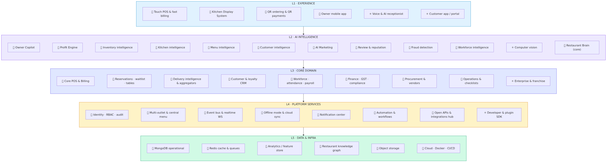

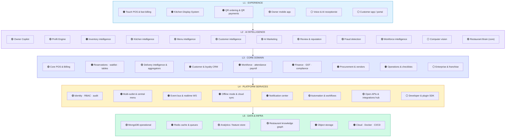
```mermaid
%% A3 — PRODUCT MODULE LANDSCAPE
%% All 21 client requirement areas organised into five layers.
%% 🟢 built in MVP · 🟠 phase 2 (operations) · 🟣 phase 3 (intelligence) · ⚪ phase 4 (scale)
flowchart TB
    subgraph L5["L5 · DATA & INFRA"]
        d1["🟢 MongoDB operational"] ~~~ d2["🟠 Redis cache & queues"] ~~~ d3["🟣 Analytics / feature store"] ~~~ d4["🟣 Restaurant knowledge graph"] ~~~ d5["🟠 Object storage"] ~~~ d6["🟠 Cloud · Docker · CI/CD"]
    end
    subgraph L4["L4 · PLATFORM SERVICES"]
        p1["🟢 Identity · RBAC · audit"] ~~~ p2["🟠 Multi-outlet & central menu"] ~~~ p3["🟠 Event bus & realtime WS"] ~~~ p4["🟠 Offline mode & cloud sync"] ~~~ p5["🟠 Notification center"] ~~~ p6["🟣 Automation & workflows"] ~~~ p7["🟣 Open APIs & integrations hub"] ~~~ p8["⚪ Developer & plugin SDK"]
    end
    subgraph L3["L3 · CORE DOMAIN"]
        c1["🟢 Core POS & Billing"] ~~~ c2["🟠 Reservations · waitlist · tables"] ~~~ c3["🟣 Delivery intelligence & aggregators"] ~~~ c4["🟠 Customer & loyalty CRM"] ~~~ c5["🟠 Workforce · attendance · payroll"] ~~~ c6["🟠 Finance · GST · compliance"] ~~~ c7["🟠 Procurement & vendors"] ~~~ c8["🟠 Operations & checklists"] ~~~ c9["⚪ Enterprise & franchise"]
    end
    subgraph L2["L2 · AI INTELLIGENCE"]
        a1["🟣 Owner Copilot"] ~~~ a2["🟣 Profit Engine"] ~~~ a3["🟠 Inventory intelligence"] ~~~ a4["🟣 Kitchen intelligence"] ~~~ a5["🟣 Menu intelligence"] ~~~ a6["🟣 Customer intelligence"] ~~~ a7["🟣 AI Marketing"] ~~~ a8["🟣 Review & reputation"] ~~~ a9["🟣 Fraud detection"] ~~~ a10["🟣 Workforce intelligence"] ~~~ a11["⚪ Computer vision"] ~~~ a12["🟣 Restaurant Brain (core)"]
    end
    subgraph L1["L1 · EXPERIENCE"]
        e1["🟠 Touch POS & fast billing"] ~~~ e2["🟠 Kitchen Display System"] ~~~ e3["🟠 QR ordering & QR payments"] ~~~ e4["🟣 Owner mobile app"] ~~~ e5["⚪ Voice & AI receptionist"] ~~~ e6["⚪ Customer app / portal"]
    end

    L1 --> L2 --> L3 --> L4 --> L5

    style L1 fill:#e0f2fe,stroke:#0284c7
    style L2 fill:#ede9fe,stroke:#7c3aed
    style L3 fill:#e0e7ff,stroke:#4f46e5
    style L4 fill:#fef3c7,stroke:#d97706
    style L5 fill:#d1fae5,stroke:#059669
```

## Architecture 4 · AI & Data Architecture

Sources → Ingest → Store → Intelligence → Action, with a feedback loop into restaurant memory. The MVP's ML service is the green seed of this pipeline.

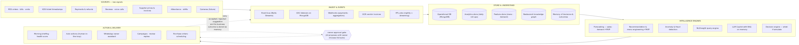

```mermaid
%% A4 — AI & DATA ARCHITECTURE
%% How the Restaurant Brain learns and acts — with the human-in-the-loop promise.
flowchart LR
    subgraph S["SOURCES — raw signals"]
        s1["POS orders · bills · voids"]
        s2["KDS ticket timestamps"]
        s3["Payments & refunds"]
        s4["Reviews · voice calls"]
        s5["Supplier prices & invoices"]
        s6["Attendance · shifts"]
        s7["Cameras (future)"]
    end

    subgraph I["INGEST & EVENTS"]
        i1["Event bus (Redis Streams)"]
        i2["CDC listeners on MongoDB"]
        i3["Webhooks (payments · aggregators)"]
        i4["OCR vendor invoices"]
        i5["ETL jobs (nightly + streaming)"]
    end

    subgraph ST["STORE & UNDERSTAND"]
        st1[("Operational DB (MongoDB)")]
        st2[("Analytics store (daily roll-ups)")]
        st3[("Feature store (menu · demand)")]
        st4[("Restaurant knowledge graph")]
        st5[("Memory of decisions & outcomes")]
    end

    subgraph AI["INTELLIGENCE ENGINES"]
        a1["Forecasting — sales · demand ✔MVP"]
        a2["Recommendation & menu engineering ✔MVP"]
        a3["Anomaly & fraud detection"]
        a4["NL2Insight query engine"]
        a5["LLM Copilot with RAG on memory"]
        a6["Decision engine — what-if simulate"]
    end

    subgraph ACT["ACTION & DELIVERY"]
        ac1["Morning briefing · health score"]
        ac2["Auto actions (human-in-the-loop)"]
        ac3["WhatsApp owner assistant"]
        ac4["Campaigns · review replies"]
        ac5["Purchase orders · scheduling"]
    end

    S --> I --> ST --> AI --> ACT
    ACT -. "feedback loop: every accepted / rejected suggestion<br>and its business outcome is stored as memory" .-> I
    ACT -.-> HITL{{"owner approval gate<br>(AI proposes until owner chooses full-auto)"}}
    HITL -.-> ACT
```

## Architecture 5 · Evolution Roadmap

Four phases from the live MVP to the full Restaurant OS. Every phase ships working, sellable software that funds the next.

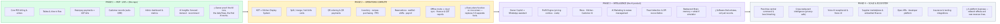

```mermaid
%% A5 — EVOLUTION ROADMAP
%% Four phases; each ships working, sellable software that funds the next.
flowchart LR
    subgraph P1["PHASE 1 — MVP · LIVE ✔ (this repo)"]
        p11["Core POS billing & orders"]
        p12["Tables & dine-in flow"]
        p13["Razorpay payments + GST bills"]
        p14["Customer records (auto-CRM)"]
        p15["Admin dashboard & metrics"]
        p16["AI Insights: forecast · demand · recommend"]
        p1v["💡 Owner proof: the till runs,<br>the data flows, the first AI works."]
    end

    subgraph P2["PHASE 2 — OPERATIONS COMPLETE"]
        p21["KOT + Kitchen Display System"]
        p22["Split / merge / hold bills · voids"]
        p23["QR ordering & QR payments"]
        p24["Inventory · recipes · purchasing · FIFO"]
        p25["Reservations · waitlist · shifts · payroll"]
        p26["Offline mode + cloud sync · finance & GST reports"]
        p2v["💡 Every store function on one screen —<br>replaces 3-4 separate tools."]
    end

    subgraph P3["PHASE 3 — INTELLIGENCE (the AI product)"]
        p31["Owner Copilot + WhatsApp assistant"]
        p32["Profit Engine (pricing · combos · costs)"]
        p33["Menu · Kitchen · Customer AI"]
        p34["AI Marketing & review management"]
        p35["Fraud detection & UPI reconciliation"]
        p36["Restaurant Brain: memory + what-if simulator"]
        p3v["💡 Software that advises, not just records."]
    end

    subgraph P4["PHASE 4 — SCALE & ECOSYSTEM"]
        p41["Franchise central command & benchmarking"]
        p42["Cross-restaurant intelligence (privacy-safe)"]
        p43["Voice AI receptionist & Vision AI"]
        p44["Supplier marketplace & embedded finance"]
        p45["Open APIs · developer platform"]
        p46["Insurance & lending integrations"]
        p4v["💡 A platform business —<br>network effects and new revenue lines."]
    end

    P1 ==> P2 ==> P3 ==> P4

    style P1 fill:#dcfce7,stroke:#16a34a
    style P2 fill:#fef3c7,stroke:#d97706
    style P3 fill:#ede9fe,stroke:#7c3aed
    style P4 fill:#f1f5f9,stroke:#475569
```

# PART 2 — THE 14 UML DIAGRAMS

## U01 · Use Case Diagram (behavioural)

System boundary, eight human/system actors, and use cases clustered by module mirroring the client requirements list. «include»/«extend» refinements shown on billing.

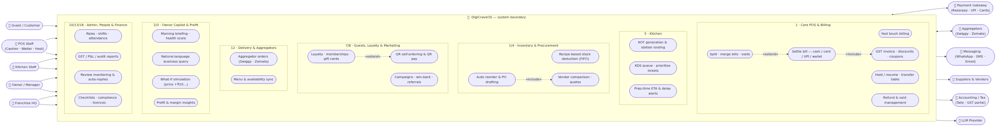

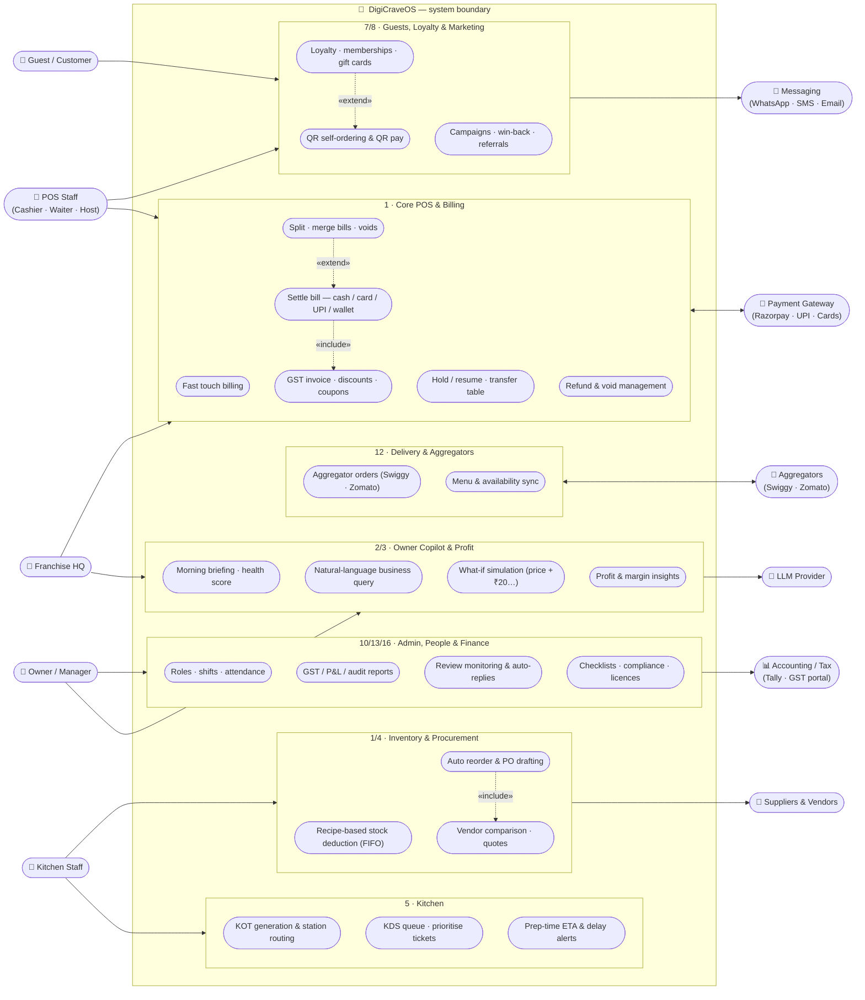
```mermaid
%% U01 — USE CASE DIAGRAM (UML 2.5 · Behavioural)
%% DigiCraveOS — AI Restaurant Operating System
%% Actors are grouped around the system boundary; use cases are clustered
%% by module (mirrors the 21-area client requirements list).
flowchart LR
    %% ================= ACTORS (left: people) =================
    C(["👤 Guest / Customer"])
    S(["👤 POS Staff<br>(Cashier · Waiter · Host)"])
    K(["👤 Kitchen Staff"])
    O(["👤 Owner / Manager"])
    HQ(["👤 Franchise HQ"])

    subgraph SYS["🏪 &nbsp;DigiCraveOS — system boundary"]
        direction TB

        subgraph BILL["1 · Core POS & Billing"]
            uc1(["Fast touch billing"])
            uc2(["Hold / resume · transfer table"])
            uc3(["Split · merge bills · voids"])
            uc4(["Settle bill — cash / card / UPI / wallet"])
            uc5(["GST invoice · discounts · coupons"])
            uc6(["Refund & void management"])
        end

        subgraph KIT["5 · Kitchen"]
            uc7(["KOT generation & station routing"])
            uc8(["KDS queue · prioritise tickets"])
            uc9(["Prep-time ETA & delay alerts"])
        end

        subgraph STOCK["1/4 · Inventory & Procurement"]
            uc10(["Recipe-based stock deduction (FIFO)"])
            uc11(["Auto reorder & PO drafting"])
            uc12(["Vendor comparison · quotes"])
        end

        subgraph GUEST["7/8 · Guests, Loyalty & Marketing"]
            uc13(["QR self-ordering & QR pay"])
            uc14(["Loyalty · memberships · gift cards"])
            uc15(["Campaigns · win-back · referrals"])
        end

        subgraph DELIV["12 · Delivery & Aggregators"]
            uc16(["Aggregator orders (Swiggy · Zomato)"])
            uc17(["Menu & availability sync"])
        end

        subgraph COCKPIT["2/3 · Owner Copilot & Profit"]
            uc18(["Morning briefing · health score"])
            uc19(["Natural-language business query"])
            uc20(["What-if simulation (price +₹20…)"])
            uc21(["Profit & margin insights"])
        end

        subgraph ADMIN["10/13/16 · Admin, People & Finance"]
            uc22(["Roles · shifts · attendance"])
            uc23(["GST / P&L / audit reports"])
            uc24(["Review monitoring & auto-replies"])
            uc25(["Checklists · compliance · licences"])
        end
    end

    %% ================= ACTORS (right: systems) =================
    PG(["🏦 Payment Gateway<br>(Razorpay · UPI · Cards)"])
    AG(["🛵 Aggregators<br>(Swiggy · Zomato)"])
    MS(["💬 Messaging<br>(WhatsApp · SMS · Email)"])
    VG(["🚚 Suppliers & Vendors"])
    TL(["📊 Accounting / Tax<br>(Tally · GST portal)"])
    AI(["🧠 LLM Provider"])

    %% ---- human actor links (to clusters) ----
    C --> GUEST
    S --> BILL
    S --> GUEST
    K --> KIT
    K --> STOCK
    O --> COCKPIT
    O --> ADMIN
    HQ --> COCKPIT
    HQ --> BILL

    %% ---- system actor links ----
    BILL <--> PG
    DELIV <--> AG
    GUEST --> MS
    STOCK --> VG
    ADMIN --> TL
    COCKPIT --> AI

    %% ---- include / extend (samples of UML refinement) ----
    uc4 -.->|"«include»"| uc5
    uc3 -.->|"«extend»"| uc4
    uc14 -.->|"«extend»"| uc13
    uc11 -.->|"«include»"| uc12
```

## U02 · Activity Diagram — order-to-cash (behavioural)

Five swimlanes: Guest, POS/Staff, Order Service, Kitchen/KDS, Billing & Payments. Message names map 1:1 to the repo's REST routes.

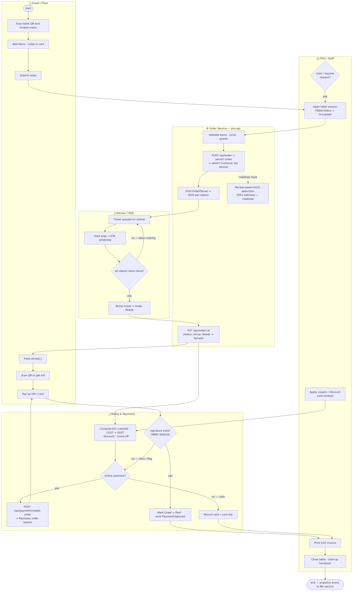

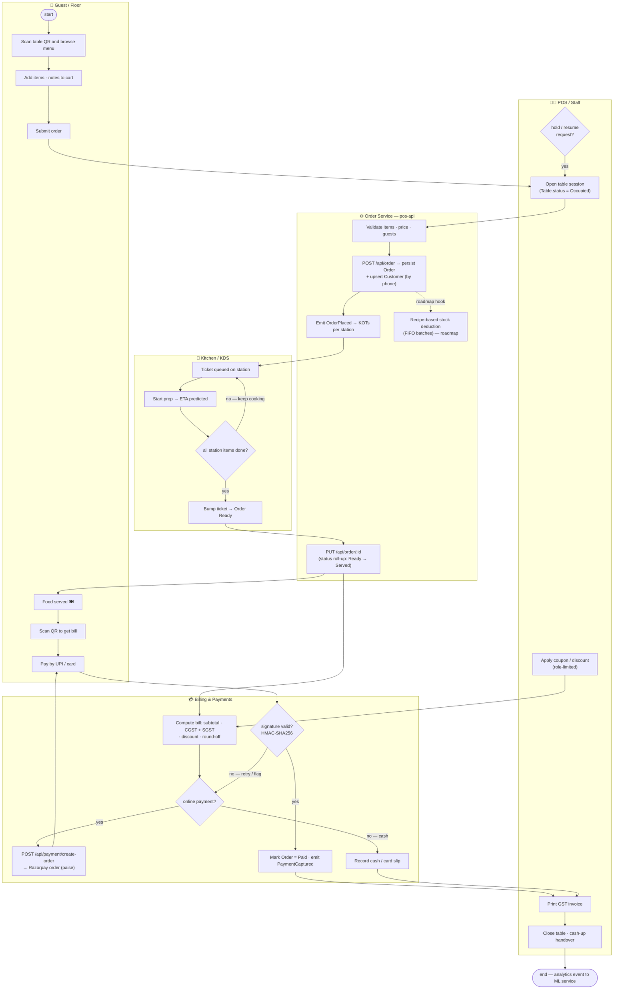
```mermaid
%% U02 — ACTIVITY DIAGRAM (UML 2.5 · Behavioural)
%% Primary flow: order-to-cash with swimlanes.
%% Lane = vertical partition of responsibility. Endpoint names map 1:1 to the MVP repo.
flowchart TB
    subgraph L1["👤 Guest / Floor"]
        A1([start]) --> A2["Scan table QR and browse menu"]
        A2 --> A3["Add items · notes to cart"]
        A3 --> A4["Submit order"]
        A9["Food served 🍽️"] --> A10["Scan QR to get bill"]
        A10 --> A11["Pay by UPI / card"]
    end

    subgraph L2["🧑‍💼 POS / Staff"]
        B1["Open table session<br>(Table.status = Occupied)"]
        B2{"hold / resume<br>request?"}
        B3["Apply coupon / discount<br>(role-limited)"]
        B4["Print GST invoice"]
        B5["Close table · cash-up handover"]
    end

    subgraph L3["⚙️ Order Service — pos-api"]
        C1["Validate items · price · guests"]
        C2["POST /api/order → persist Order<br>+ upsert Customer (by phone)"]
        C3["Emit OrderPlaced → KOTs per station"]
        C4["PUT /api/order/:id<br>(status roll-up: Ready → Served)"]
        C5["Recipe-based stock deduction<br>(FIFO batches) — roadmap"]
    end

    subgraph L4["🍳 Kitchen / KDS"]
        D1["Ticket queued on station"]
        D2["Start prep → ETA predicted"]
        D3{"all station items done?"}
        D4["Bump ticket → Order Ready"]
    end

    subgraph L5["💳 Billing & Payments"]
        E1["Compute bill: subtotal · CGST + SGST<br>· discount · round-off"]
        E2{"online payment?"}
        E3["POST /api/payment/create-order<br>→ Razorpay order (paise)"]
        E4{"signature valid?<br>HMAC-SHA256"}
        E5["Mark Order = Paid · emit PaymentCaptured"]
        E6["Record cash / card slip"]
    end

    %% --- flow across lanes ---
    A4 --> B1
    B1 --> C1
    B2 -->|"yes"| B1
    C1 --> C2 --> C3 --> D1
    C2 -.->|"roadmap hook"| C5
    D1 --> D2 --> D3
    D3 -->|"no — keep cooking"| D1
    D3 -->|"yes"| D4 --> C4 --> A9
    C4 --> E1
    B3 --> E1
    E1 --> E2
    E2 -->|"yes"| E3 --> A11
    A11 --> E4
    E4 -->|"no — retry / flag"| E2
    E4 -->|"yes"| E5
    E2 -->|"no — cash"| E6
    E5 --> B4
    E6 --> B4
    B4 --> B5 --> A12([end — analytics event to ML service])
```

## U03 · Class Diagram (structural)

The domain model. Classes marked «MVP ✔» are implemented exactly as coded in pos-backend/models; everything else is the product build-out.

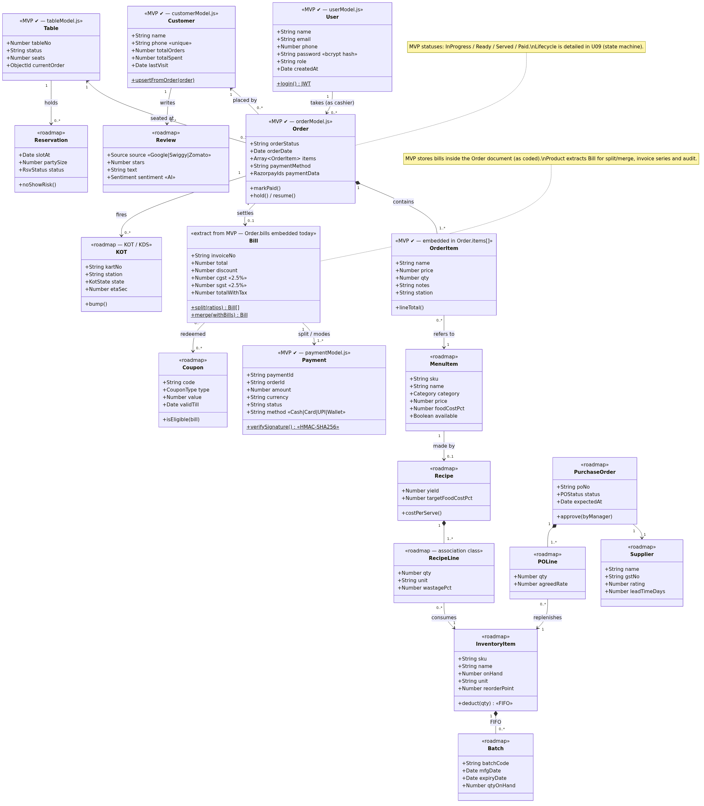

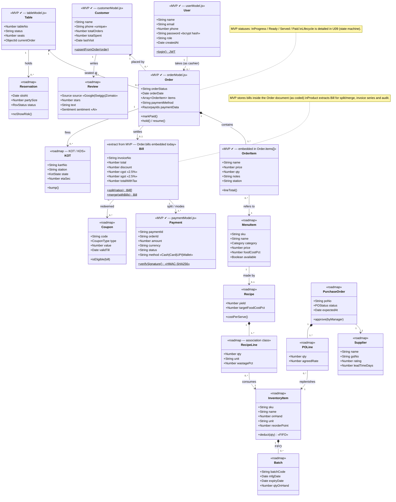
```mermaid
%% U03 — CLASS DIAGRAM (UML 2.5 · Structural)
%% Domain model. Stereotype «MVP ✔» = implemented in the repo today
%% (pos-backend/models). All other classes are the product build-out.
%% Style: attributes/methods shown for MVP classes exactly as coded.
classDiagram
    direction TB

    class User {
        <<MVP ✔ — userModel.js>>
        +String name
        +String email
        +Number phone
        +String password  «bcrypt hash»
        +String role
        +Date createdAt
        +login()$ JWT
    }

    class Customer {
        <<MVP ✔ — customerModel.js>>
        +String name
        +String phone  «unique»
        +Number totalOrders
        +Number totalSpent
        +Date lastVisit
        +upsertFromOrder(order)$
    }

    class Table {
        <<MVP ✔ — tableModel.js>>
        +Number tableNo
        +String status
        +Number seats
        +ObjectId currentOrder
    }

    class Order {
        <<MVP ✔ — orderModel.js>>
        +String orderStatus
        +Date orderDate
        +Array~OrderItem~ items
        +String paymentMethod
        +RazorpayIds paymentData
        +markPaid()
        +hold() / resume()
    }

    class OrderItem {
        <<MVP ✔ — embedded in Order.items[]>>
        +String name
        +Number price
        +Number qty
        +String notes
        +String station
        +lineTotal()
    }

    class Bill {
        <<extract from MVP — Order.bills embedded today>>
        +String invoiceNo
        +Number total
        +Number discount
        +Number cgst  «2.5%»
        +Number sgst  «2.5%»
        +Number totalWithTax
        +split(ratios)$ Bill[]
        +merge(withBills)$ Bill
    }

    class Payment {
        <<MVP ✔ — paymentModel.js>>
        +String paymentId
        +String orderId
        +Number amount
        +String currency
        +String status
        +String method  «Cash|Card|UPI|Wallet»
        +verifySignature()$ «HMAC-SHA256»
    }

    class MenuItem {
        <<roadmap>>
        +String sku
        +String name
        +Category category
        +Number price
        +Number foodCostPct
        +Boolean available
    }

    class Recipe {
        <<roadmap>>
        +Number yield
        +Number targetFoodCostPct
        +costPerServe()
    }

    class RecipeLine {
        <<roadmap — association class>>
        +Number qty
        +String unit
        +Number wastagePct
    }

    class InventoryItem {
        <<roadmap>>
        +String sku
        +String name
        +Number onHand
        +String unit
        +Number reorderPoint
        +deduct(qty) «FIFO»
    }

    class Batch {
        <<roadmap>>
        +String batchCode
        +Date mfgDate
        +Date expiryDate
        +Number qtyOnHand
    }

    class PurchaseOrder {
        <<roadmap>>
        +String poNo
        +POStatus status
        +Date expectedAt
        +approve(byManager)
    }

    class POLine {
        <<roadmap>>
        +Number qty
        +Number agreedRate
    }

    class Supplier {
        <<roadmap>>
        +String name
        +String gstNo
        +Number rating
        +Number leadTimeDays
    }

    class Reservation {
        <<roadmap>>
        +Date slotAt
        +Number partySize
        +RsvStatus status
        +noShowRisk()
    }

    class KOT {
        <<roadmap — KOT / KDS>>
        +String kartNo
        +String station
        +KotState state
        +Number etaSec
        +bump()
    }

    class Coupon {
        <<roadmap>>
        +String code
        +CouponType type
        +Number value
        +Date validTill
        +isEligible(bill)
    }

    class Review {
        <<roadmap>>
        +Source source  «Google|Swiggy|Zomato»
        +Number stars
        +String text
        +Sentiment sentiment  «AI»
    }

    %% ============ relationships ============
    User "1" --> "0..*" Order : takes (as cashier)
    Customer "1" <-- "0..*" Order : placed by
    Table "1" <-- "0..1" Order : seated at
    Table "1" --> "0..*" Reservation : holds
    Order "1" *-- "1..*" OrderItem : contains
    Order "1" --> "0..1" Bill : settles
    Bill "1" --> "1..*" Payment : split / modes
    OrderItem "0..*" --> "1" MenuItem : refers to
    MenuItem "1" --> "0..1" Recipe : made by
    Recipe "1" *-- "1..*" RecipeLine
    RecipeLine "0..*" --> "1" InventoryItem : consumes
    InventoryItem "1" *-- "0..*" Batch : FIFO
    PurchaseOrder "1" --> "1" Supplier
    PurchaseOrder "1" *-- "1..*" POLine
    POLine "0..*" --> "1" InventoryItem : replenishes
    Bill "0..*" --> "0..*" Coupon : redeemed
    Order "1" --> "0..*" KOT : fires
    Customer "1" --> "0..*" Review : writes

    note for Bill "MVP stores bills inside the Order document (as coded).\nProduct extracts Bill for split/merge, invoice series and audit."
    note for Order "MVP statuses: InProgress / Ready / Served / Paid.\nLifecycle is detailed in U09 (state machine)."
```

## U04 · Object Diagram (structural)

Runtime snapshot: Friday dinner rush, 21:07 — Table 12, order o1047 in flight, two KOTs, UPI payment pending, FIFO batch deduction.

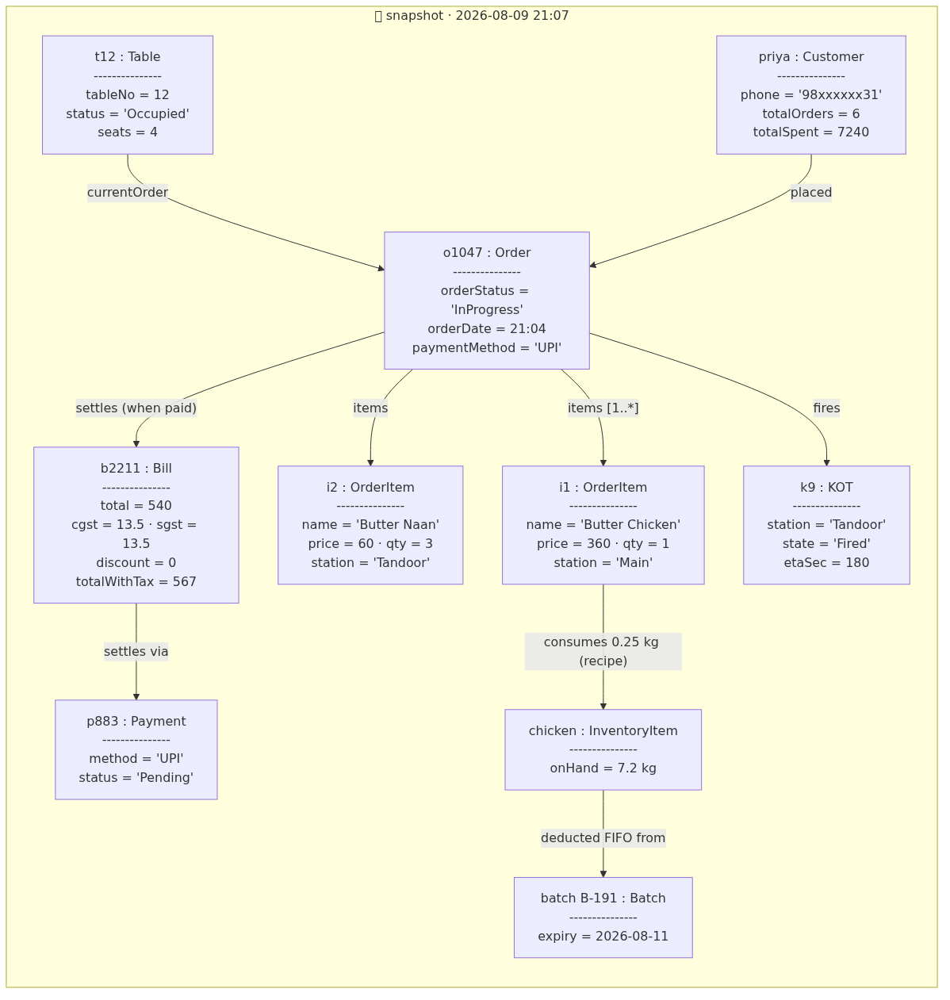

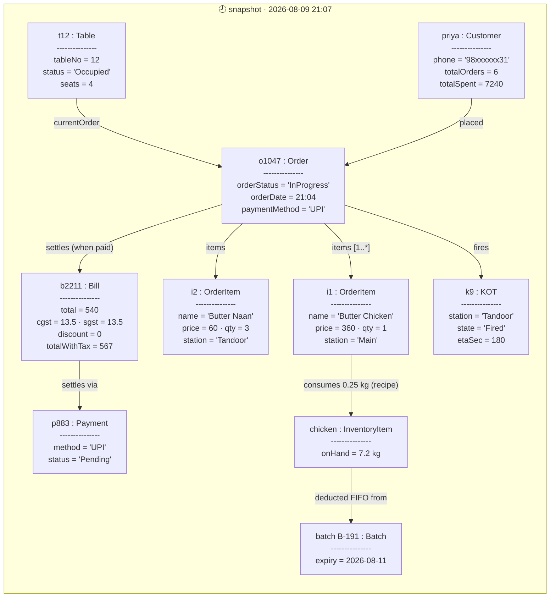
```mermaid
%% U04 — OBJECT DIAGRAM (UML 2.5 · Structural)
%% A runtime snapshot of the domain model at a concrete moment:
%% Friday dinner rush, 9-Aug-2026, 21:07 — Table 12, two KOTs in flight.
flowchart LR
    subgraph SNAP["🕘 snapshot · 2026-08-09 21:07"]
        direction TB

        t12["t12 : Table<br>---------------<br>tableNo = 12<br>status = 'Occupied'<br>seats = 4"]

        cust["priya : Customer<br>---------------<br>phone = '98xxxxxx31'<br>totalOrders = 6<br>totalSpent = 7240"] 

        o1047["o1047 : Order<br>---------------<br>orderStatus = 'InProgress'<br>orderDate = 21:04<br>paymentMethod = 'UPI'"]

        i1["i1 : OrderItem<br>---------------<br>name = 'Butter Chicken'<br>price = 360 · qty = 1<br>station = 'Main'"]

        i2["i2 : OrderItem<br>---------------<br>name = 'Butter Naan'<br>price = 60 · qty = 3<br>station = 'Tandoor'"]

        b2211["b2211 : Bill<br>---------------<br>total = 540<br>cgst = 13.5 · sgst = 13.5<br>discount = 0<br>totalWithTax = 567"]

        k9["k9 : KOT<br>---------------<br>station = 'Tandoor'<br>state = 'Fired'<br>etaSec = 180"]

        p883["p883 : Payment<br>---------------<br>method = 'UPI'<br>status = 'Pending'"]

        chik["chicken : InventoryItem<br>---------------<br>onHand = 7.2 kg"]
        bat["batch B-191 : Batch<br>---------------<br>expiry = 2026-08-11"]
    end

    t12 -- "currentOrder" --> o1047
    cust -- "placed" --> o1047
    o1047 -- "items [1..*]" --> i1
    o1047 -- "items" --> i2
    o1047 -- "settles (when paid)" --> b2211
    o1047 -- "fires" --> k9
    b2211 -- "settles via" --> p883
    i1 -- "consumes 0.25 kg (recipe)" --> chik
    chik -- "deducted FIFO from" --> bat
```

## U05 · Component Diagram (structural)

The pos-api container decomposed into components with provided/required interfaces. Green-tinted components exist in the MVP.

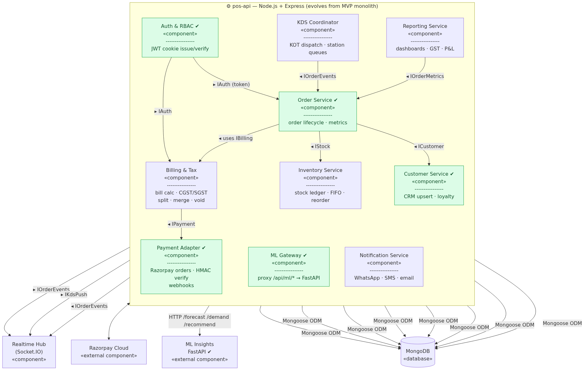

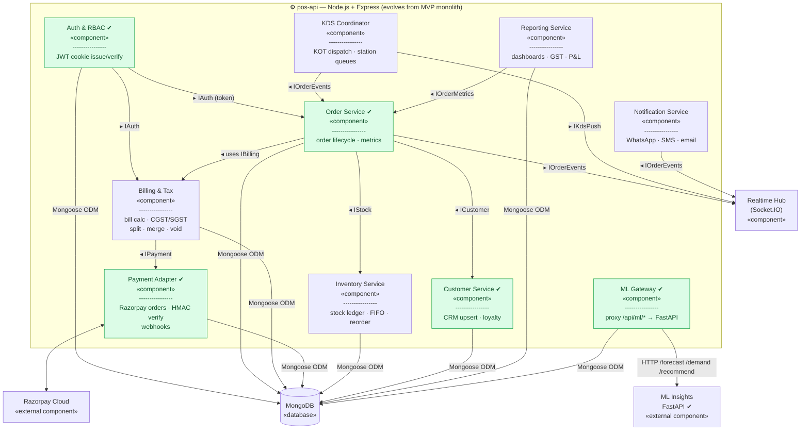
```mermaid
%% U05 — COMPONENT DIAGRAM (UML 2.5 · Structural)
%% The pos-api container decomposed into components with provided (ball)
%% and required (socket) interfaces. MVP components marked ✔.
flowchart TB
    subgraph API["⚙️ pos-api — Node.js + Express (evolves from MVP monolith)"]
        direction TB

        AuthC["Auth & RBAC ✔<br>«component»<br>----------------<br>JWT cookie issue/verify"]
        OrderC["Order Service ✔<br>«component»<br>----------------<br>order lifecycle · metrics"]
        BillC["Billing & Tax<br>«component»<br>----------------<br>bill calc · CGST/SGST<br>split · merge · void"]
        PayC["Payment Adapter ✔<br>«component»<br>----------------<br>Razorpay orders · HMAC verify<br>webhooks"]
        KDS-C["KDS Coordinator<br>«component»<br>----------------<br>KOT dispatch · station queues"]
        InvC["Inventory Service<br>«component»<br>----------------<br>stock ledger · FIFO · reorder"]
        CustC["Customer Service ✔<br>«component»<br>----------------<br>CRM upsert · loyalty"]
        MLC["ML Gateway ✔<br>«component»<br>----------------<br>proxy /api/ml/* → FastAPI"]
        RepC["Reporting Service<br>«component»<br>----------------<br>dashboards · GST · P&L"]
        NotC["Notification Service<br>«component»<br>----------------<br>WhatsApp · SMS · email"]
    end

    WS["Realtime Hub<br>(Socket.IO)<br>«component»"]
    DB[("MongoDB<br>«database»")]
    ML["ML Insights<br>FastAPI ✔<br>«external component»"]
    RZP["Razorpay Cloud<br>«external component»"]

    AuthC -- "▸ IAuth (token)" --> OrderC
    AuthC -- "▸ IAuth" --> BillC
    OrderC -- "◂ uses IBilling" --> BillC
    OrderC -- "▸ IOrderEvents" --> WS
    BillC -- "◂ IPayment" --> PayC
    PayC <--> RZP
    OrderC -- "◂ IStock" --> InvC
    KDS-C -- "◂ IOrderEvents" --> OrderC
    KDS-C -- "▸ IKdsPush" --> WS
    OrderC -- "◂ ICustomer" --> CustC
    MLC -- "HTTP /forecast /demand /recommend" --> ML
    RepC -- "◂ IOrderMetrics" --> OrderC
    NotC -- "◂ IOrderEvents" --> WS

    AuthC & OrderC & BillC & PayC & InvC & CustC & RepC & MLC -- "Mongoose ODM" --> DB

    classDef mvp fill:#dcfce7,stroke:#16a34a,color:#14532d;
    class AuthC,OrderC,PayC,CustC,MLC mvp;
```

## U06 · Deployment Diagram (structural)

UML nodes («device», «executionEnvironment», «node»): POS terminal, KDS screen, guest phone, outlet mini-server, cloud containers, external SaaS.

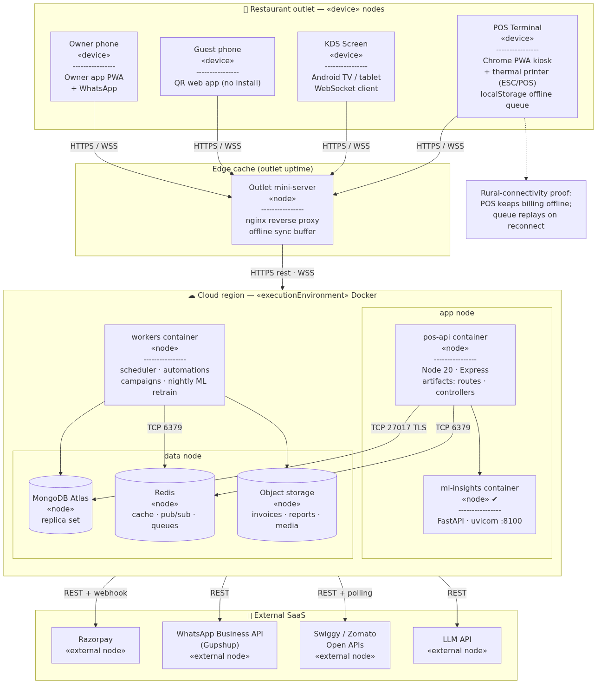

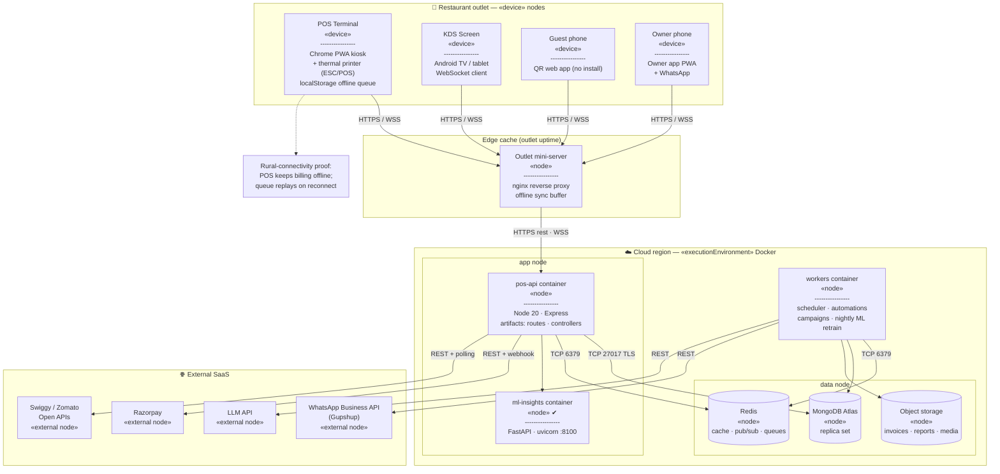
```mermaid
%% U06 — DEPLOYMENT DIAGRAM (UML 2.5 · Structural)
%% Where the software physically runs. Uses «device», «executionEnvironment»,
%% «artifact» conventions as UML nodes (3D boxes).
flowchart TB
    subgraph FLOOR["🏪 Restaurant outlet — «device» nodes"]
        POS["POS Terminal<br>«device»<br>----------------<br>Chrome PWA kiosk<br>+ thermal printer (ESC/POS)<br>localStorage offline queue"]
        KDS["KDS Screen<br>«device»<br>----------------<br>Android TV / tablet<br>WebSocket client"]
        TABQR["Guest phone<br>«device»<br>----------------<br>QR web app (no install)"]
        OWNER["Owner phone<br>«device»<br>----------------<br>Owner app PWA<br>+ WhatsApp"]
    end

    subgraph EDGE["Edge cache (outlet uptime)"]
        GW["Outlet mini-server<br>«node»<br>----------------<br>nginx reverse proxy<br>offline sync buffer"]
    end

    subgraph CLOUD["☁️ Cloud region — «executionEnvironment» Docker"]
        direction TB
        subgraph NODEAPI["app node"]
            API["pos-api container<br>«node»<br>----------------<br>Node 20 · Express<br>artifacts: routes · controllers"]
            ML["ml-insights container<br>«node» ✔<br>----------------<br>FastAPI · uvicorn :8100"]
        end
        subgraph DATAN["data node"]
            MG[("MongoDB Atlas<br>«node»<br>replica set")]
            RD[("Redis<br>«node»<br>cache · pub/sub · queues")]
            S3[("Object storage<br>«node»<br>invoices · reports · media")]
        end
        WRK["workers container<br>«node»<br>----------------<br>scheduler · automations<br>campaigns · nightly ML retrain"]
    end

    subgraph EXT["🌐 External SaaS"]
        RZ["Razorpay<br>«external node»"]
        WA["WhatsApp Business API<br>(Gupshup)<br>«external node»"]
        AGG["Swiggy / Zomato<br>Open APIs<br>«external node»"]
        LLM["LLM API<br>«external node»"]
    end

    POS & KDS & TABQR & OWNER -- "HTTPS / WSS" --> GW
    GW -- "HTTPS rest · WSS" --> API
    API -- "TCP 27017 TLS" --> MG
    API & WRK -- "TCP 6379" --> RD
    API --> ML
    WRK --> MG
    WRK --> S3
    API -- "REST + webhook" --> RZ
    WRK -- "REST" --> WA
    API -- "REST + polling" --> AGG
    WRK -- "REST" --> LLM

    note1["Rural-connectivity proof:<br>POS keeps billing offline;<br>queue replays on reconnect"]
    POS -.-> note1
```

## U07 · Package Diagram (structural)

Namespace organisation mirroring the repo folders, with «use» dependencies and the target split-out packages.

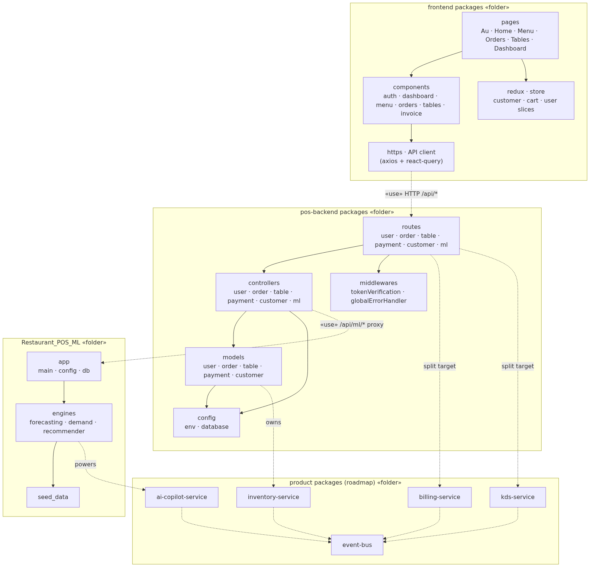

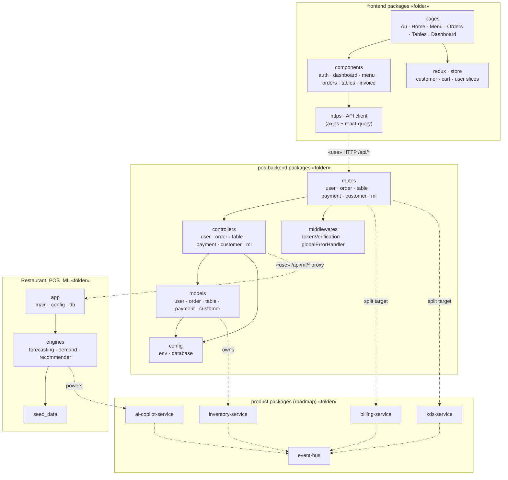
```mermaid
%% U07 — PACKAGE DIAGRAM (UML 2.5 · Structural)
%% Namespace organisation + package dependencies («use» = dashed open arrow).
%% Mirrors the repository today and its target split.
flowchart TB
    subgraph UI["frontend packages «folder»"]
        PAGES["pages<br>Au · Home · Menu · Orders · Tables · Dashboard"]
        COMPS["components<br>auth · dashboard · menu · orders · tables · invoice"]
        STORE["redux · store<br>customer · cart · user slices"]
        NET["https · API client<br>(axios + react-query)"]
    end

    subgraph CORE["pos-backend packages «folder»"]
        ROUTES["routes<br>user · order · table · payment · customer · ml"]
        CTRL["controllers<br>user · order · table · payment · customer · ml"]
        MIDW["middlewares<br>tokenVerification · globalErrorHandler"]
        MODELS["models<br>user · order · table · payment · customer"]
        CONFIG["config<br>env · database"]
    end

    subgraph MLSVC["Restaurant_POS_ML «folder»"]
        APP["app<br>main · config · db"]
        ENG["engines<br>forecasting · demand · recommender"]
        SEED["seed_data"]
    end

    subgraph FUTURE["product packages (roadmap) «folder»"]
        KDSPKG["kds-service"]
        INVPKG["inventory-service"]
        BILLPKG["billing-service"]
        COPILOT["ai-copilot-service"]
        EVENTS["event-bus"]
    end

    PAGES --> COMPS
    PAGES --> STORE
    COMPS --> NET
    NET -.->|"«use» HTTP /api/*"| ROUTES
    ROUTES --> CTRL
    ROUTES --> MIDW
    CTRL --> MODELS
    CTRL --> CONFIG
    MODELS --> CONFIG
    CTRL -.->|"«use» /api/ml/* proxy"| APP
    APP --> ENG
    ENG --> SEED

    ROUTES -.->|"split target"| BILLPKG
    ROUTES -.->|"split target"| KDSPKG
    MODELS -.->|"owns"| INVPKG
    ENG -.->|"powers"| COPILOT
    BILLPKG & KDSPKG & INVPKG -.-> EVENTS
    COPILOT -.-> EVENTS
```

## U08 · Composite Structure Diagram (structural)

Internal structure of the PosApiServer composite: parts, ports (◧/◨) and connectors — how a request flows through the running server.

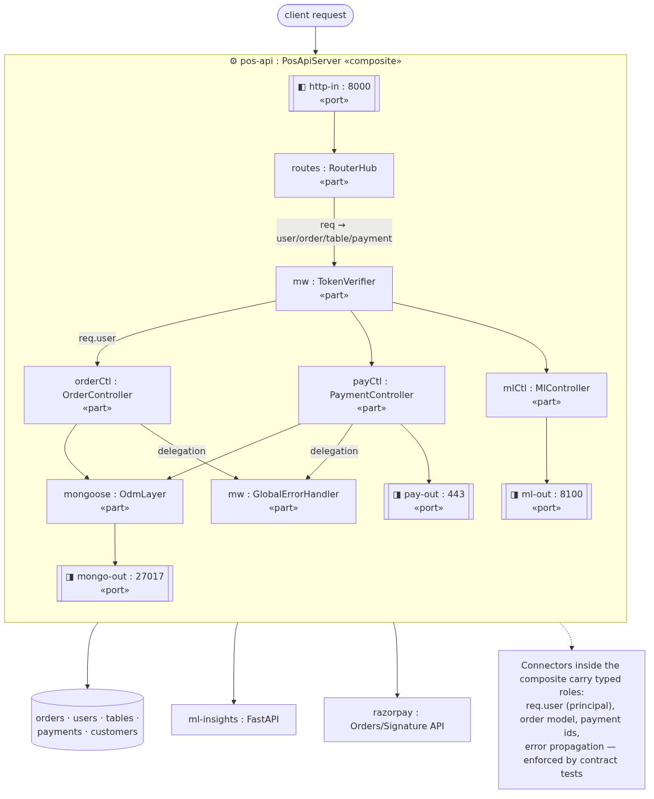

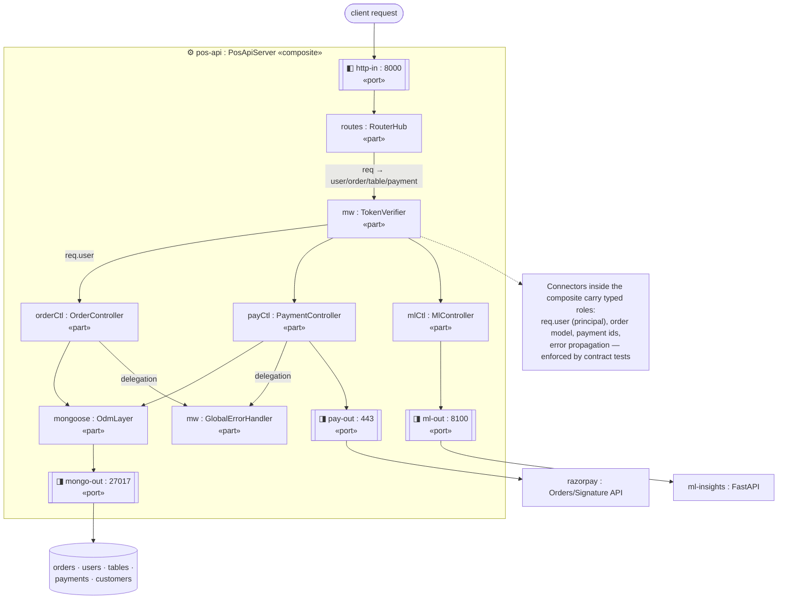
```mermaid
%% U08 — COMPOSITE STRUCTURE DIAGRAM (UML 2.5 · Structural)
%% Internal structure of the pos-api classifier: collaborating parts,
%% ports (squares on the border) and connectors between them.
flowchart TB
    subgraph CS["⚙️ pos-api : PosApiServer  «composite»"]
        direction TB

        PORT1[["◧ http-in : 8000<br>«port»"]]
        GW["routes : RouterHub<br>«part»"]
        AUTH["mw : TokenVerifier<br>«part»"]
        ERR["mw : GlobalErrorHandler<br>«part»"]
        ORD["orderCtl : OrderController<br>«part»"]
        PAY["payCtl : PaymentController<br>«part»"]
        MLC["mlCtl : MlController<br>«part»"]
        ODM["mongoose : OdmLayer<br>«part»"]
        PORT2[["◨ mongo-out : 27017<br>«port»"]]
        PORT3[["◨ ml-out : 8100<br>«port»"]]
        PORT4[["◨ pay-out : 443<br>«port»"]]
    end

    REQ(["client request"])
    MONGO[("orders · users · tables ·<br>payments · customers")]
    MLAPI["ml-insights : FastAPI"]
    RZP["razorpay : Orders/Signature API"]

    REQ --> PORT1
    PORT1 --> GW
    GW -->|"req → user/order/table/payment"| AUTH
    AUTH -->|"req.user"| ORD
    AUTH --> PAY
    AUTH --> MLC
    ORD --> ODM
    PAY --> ODM
    ORD -- "delegation" --> ERR
    PAY -- "delegation" --> ERR
    ODM --> PORT2
    MLC --> PORT3
    PAY --> PORT4
    PORT2 --> MONGO
    PORT3 --> MLAPI
    PORT4 --> RZP

    note1["Connectors inside the composite carry typed roles:<br>req.user (principal), order model, payment ids,<br>error propagation — enforced by contract tests"]
    AUTH -.-> note1
```

## U09 · Profile Diagram (structural)

The DigiCraveOS domain profile: stereotypes («DineInOrder», «AggregatorOrder»…), tagged values and OCL-style business constraints extending UML to speak "restaurant".

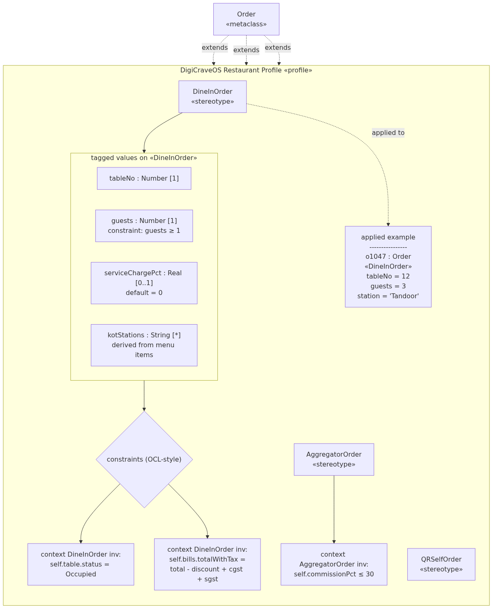

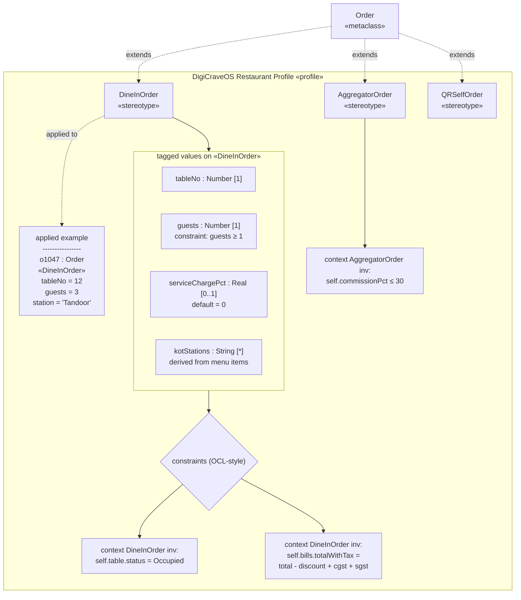
```mermaid
%% U09 — PROFILE DIAGRAM (UML 2.5 · Structural)
%% The DigiCraveOS domain profile applied to the Order metaclass:
%% tagged values, constraints and applied stereotypes — how we extend
%% plain UML to speak "restaurant".
flowchart TB
    MC["Order<br>«metaclass»"]

    subgraph PROF["DigiCraveOS Restaurant Profile «profile»"]
        direction TB

        ST1["DineInOrder<br>«stereotype»"]
        ST2["AggregatorOrder<br>«stereotype»"]
        ST3["QRSelfOrder<br>«stereotype»"]

        subgraph TV["tagged values on «DineInOrder»"]
            tv1["tableNo : Number [1]"]
            tv2["guests : Number [1]<br>constraint: guests ≥ 1"]
            tv3["serviceChargePct : Real [0..1]<br>default = 0"]
            tv4["kotStations : String [*]<br>derived from menu items"]
        end

        C1{"constraints (OCL-style)"}
        c1["context DineInOrder inv:<br>self.table.status = Occupied"]
        c2["context DineInOrder inv:<br>self.bills.totalWithTax =<br>total - discount + cgst + sgst"]
        c3["context AggregatorOrder inv:<br>self.commissionPct ≤ 30"]

        APPLIED["applied example<br>----------------<br>o1047 : Order<br>«DineInOrder»<br>tableNo = 12<br>guests = 3<br>station = 'Tandoor'"]
    end

    MC -.->|"extends"| ST1
    MC -.->|"extends"| ST2
    MC -.->|"extends"| ST3
    ST1 --> TV
    TV --> C1
    C1 --> c1
    C1 --> c2
    ST2 --> c3
    ST1 -.->|"applied to"| APPLIED
```

## U10 · State Machine Diagram (behavioural)

Full Order lifecycle: Draft → Placed → InProgress → Ready → Served → Billing (composite with split/merge) → Paid → Closed, plus hold/void/refund branches with guards.

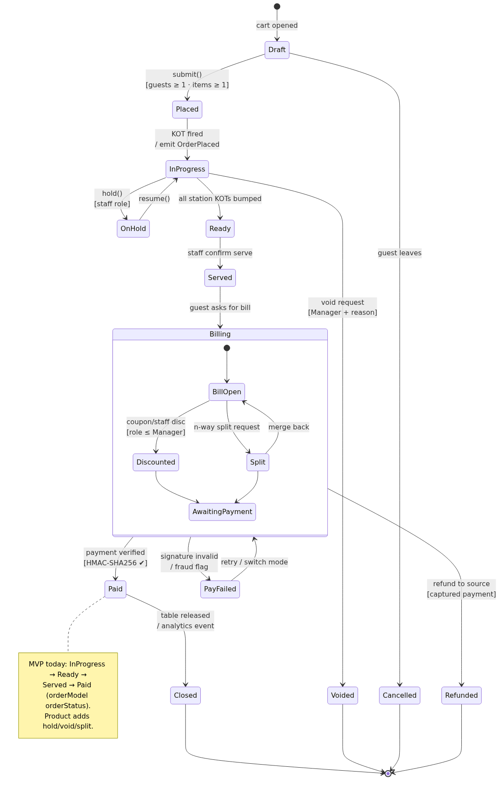

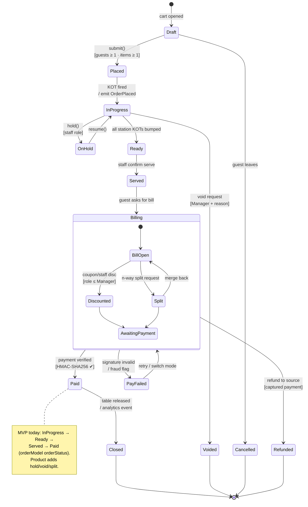
```mermaid
%% U10 — STATE MACHINE DIAGRAM (UML 2.5 · Behavioural)
%% Lifecycle of the Order entity — MVP transitions (solid names) plus
%% product states for hold/void/split. Guards in [square brackets].
stateDiagram-v2
    [*] --> Draft : cart opened
    Draft --> Placed : submit()<br>[guests ≥ 1 · items ≥ 1]
    Placed --> InProgress : KOT fired<br>/ emit OrderPlaced

    InProgress --> OnHold : hold()<br>[staff role]
    OnHold --> InProgress : resume()
    InProgress --> Ready : all station KOTs bumped
    Ready --> Served : staff confirm serve

    state Billing {
        [*] --> BillOpen
        BillOpen --> Discounted : coupon/staff disc<br>[role ≤ Manager]
        BillOpen --> Split : n-way split request
        Split --> BillOpen : merge back
        Discounted --> AwaitingPayment
        Split --> AwaitingPayment
    }

    Served --> Billing : guest asks for bill
    Billing --> Paid : payment verified<br>[HMAC-SHA256 ✔]
    Billing --> PayFailed : signature invalid<br>/ fraud flag
    PayFailed --> Billing : retry / switch mode

    Paid --> Closed : table released<br>/ analytics event
    Closed --> [*]

    InProgress --> Voided : void request<br>[Manager + reason]
    Billing --> Refunded : refund to source<br>[captured payment]
    Draft --> Cancelled : guest leaves
    Voided --> [*]
    Cancelled --> [*]
    Refunded --> [*]

    note right of Paid
        MVP today: InProgress → Ready →
        Served → Paid (orderModel orderStatus).
        Product adds hold/void/split.
    end note
```

## U11 · Sequence Diagram — QR order to KOT (behavioural)

The primary happy-path interaction, from QR scan to KOT dispatch, with JWT verification and customer upsert exactly as coded.

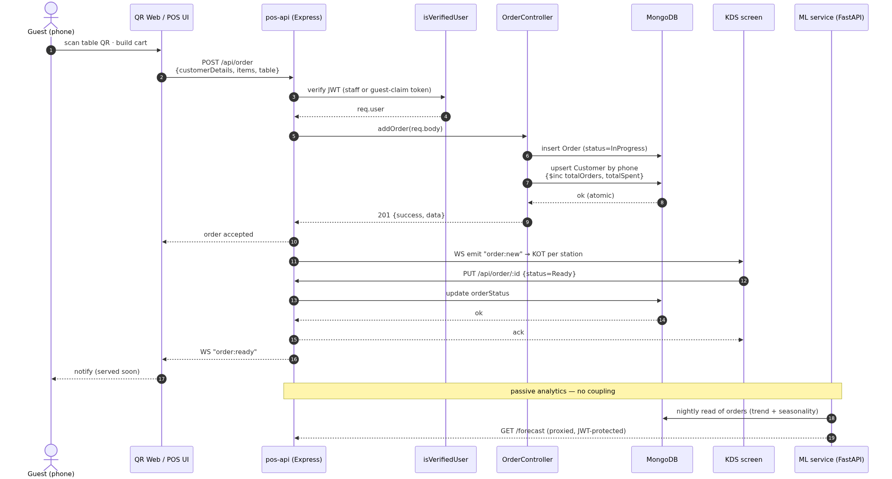

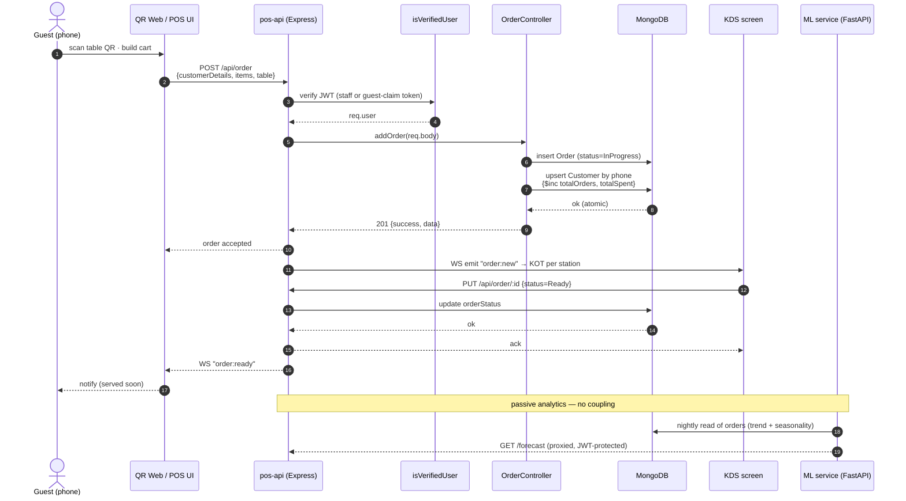
```mermaid
%% U11 — SEQUENCE DIAGRAM #1 (UML 2.5 · Behavioural)
%% "Guest QR order → KOT → pay" — message names match the repo's REST routes.
sequenceDiagram
    autonumber
    actor G as Guest (phone)
    participant FE as QR Web / POS UI
    participant API as pos-api (Express)
    participant MW as isVerifiedUser
    participant OC as OrderController
    participant DB as MongoDB
    participant KDS as KDS screen
    participant ML as ML service (FastAPI)

    G->>FE: scan table QR · build cart
    FE->>API: POST /api/order<br>{customerDetails, items, table}
    API->>MW: verify JWT (staff or guest-claim token)
    MW-->>API: req.user
    API->>OC: addOrder(req.body)
    OC->>DB: insert Order (status=InProgress)
    OC->>DB: upsert Customer by phone<br>{$inc totalOrders, totalSpent}
    DB-->>OC: ok (atomic)
    OC-->>API: 201 {success, data}
    API-->>FE: order accepted
    API->>KDS: WS emit "order:new" → KOT per station
    KDS->>API: PUT /api/order/:id {status=Ready}
    API->>DB: update orderStatus
    DB-->>API: ok
    API-->>KDS: ack
    API-->>FE: WS "order:ready"
    FE-->>G: notify (served soon)

    Note over API,ML: passive analytics — no coupling
    ML->>DB: nightly read of orders (trend + seasonality)
    ML-->>API: GET /forecast (proxied, JWT-protected)
```

## U12 · Communication Diagram (behavioural)

Same interaction as U11 but emphasising object links and message numbering — for discussing which components may talk to which.

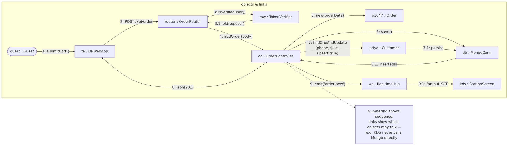

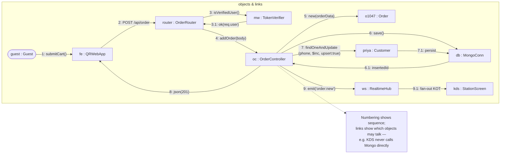
```mermaid
%% U13 — COMMUNICATION DIAGRAM (UML 2.5 · Behavioural)
%% Same semantics as a sequence diagram but emphasises object links.
%% Message order is encoded by numbering (1, 1.1, 2...).
flowchart LR
    subgraph LINKS["objects & links"]
        G(["guest : Guest"])
        FE["fe : QRWebApp"]
        ROUTER["router : OrderRouter"]
        MW["mw : TokenVerifier"]
        OC["oc : OrderController"]
        ORDDOC["o1047 : Order"]
        CUSTDOC["priya : Customer"]
        DB["db : MongoConn"]
        WSHUB["ws : RealtimeHub"]
        KDS["kds : StationScreen"]
    end

    G -- "1: submitCart()" --> FE
    FE -- "2: POST /api/order" --> ROUTER
    ROUTER -- "3: isVerifiedUser()" --> MW
    MW -- "3.1: ok(req.user)" --> ROUTER
    ROUTER -- "4: addOrder(body)" --> OC
    OC -- "5: new(orderData)" --> ORDDOC
    OC -- "6: save()" --> DB
    DB -- "6.1: insertedId" --> OC
    OC -- "7: findOneAndUpdate<br>(phone, $inc, upsert:true)" --> CUSTDOC
    CUSTDOC -- "7.1: persist" --> DB
    OC -- "8: json(201)" --> FE
    OC -- "9: emit('order:new')" --> WSHUB
    WSHUB -- "9.1: fan-out KOT" --> KDS

    note1["Numbering shows sequence;<br>links show which objects may talk —<br>e.g. KDS never calls Mongo directly"]
    OC -.-> note1
```

## U13 · Timing Diagram (behavioural)

Lifelines over a shared clock: order o1047 vs the 22-minute SLA — hard constraints on KOT firing (≤3 min), grilling (≤10 min) and UPI verify (≤60 s).

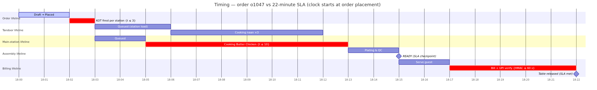

```mermaid
%% U13 — TIMING DIAGRAM (UML 2.5 · Behavioural)
%% Real constraints on lifelines over a time axis. Rendered via Mermaid's
%% closest analog (gantt = value/duration on a shared clock):
%% order o1047 must finish service within the restaurant's 22-minute SLA.
gantt
    title Timing — order o1047 vs 22-minute SLA (clock starts at order placement)
    dateFormat HH:mm
    axisFormat %H:%M

    section Order lifeline
    Draft → Placed                    :active, 18:00, 18:02
    KOT fired per station  {t ≤ 3}    :crit, 18:02, 18:03
    section Tandoor lifeline
    Queued (station load)             :18:03, 18:06
    Cooking naan ×3                   :18:06, 18:12
    section Main-station lifeline
    Queued                            :18:03, 18:05
    Cooking Butter Chicken  {t ≤ 10}  :crit, 18:05, 18:13
    section Assembly lifeline
    Plating & QC                      :18:13, 18:15
    READY (SLA checkpoint)            :milestone, 18:15, 18:15
    section Billing lifeline
    Serve guest                       :18:15, 18:17
    Bill + UPI verify {HMAC ≤ 60 s}   :crit, 18:17, 18:22
    Table released (SLA met)          :milestone, 18:22, 18:22
```

## U14 · Interaction Overview Diagram (behavioural)

An activity diagram whose nodes are whole interactions («sd» frames) — how a restaurant's full day composes the other diagrams, ending in nightly ML retraining.

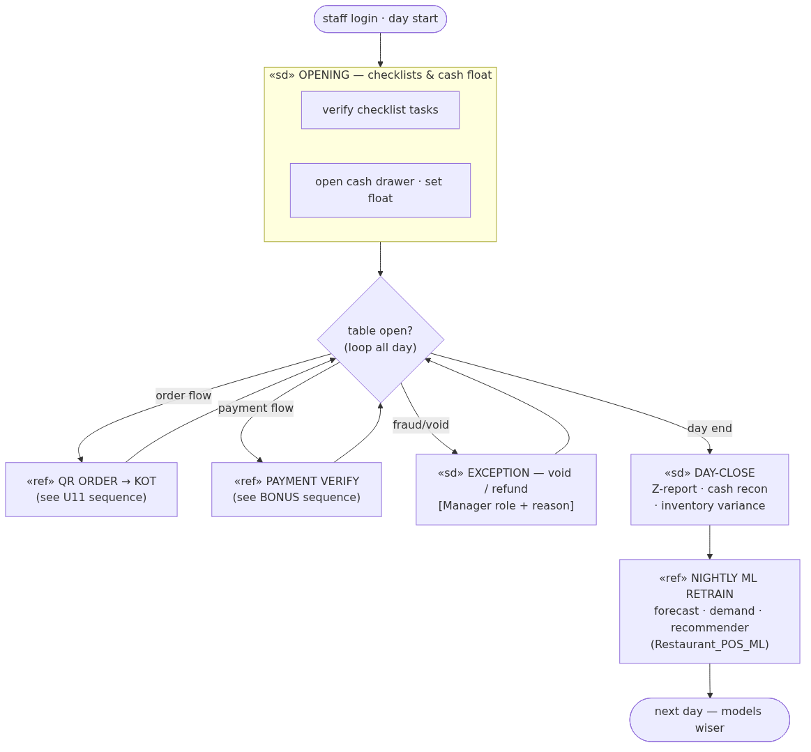

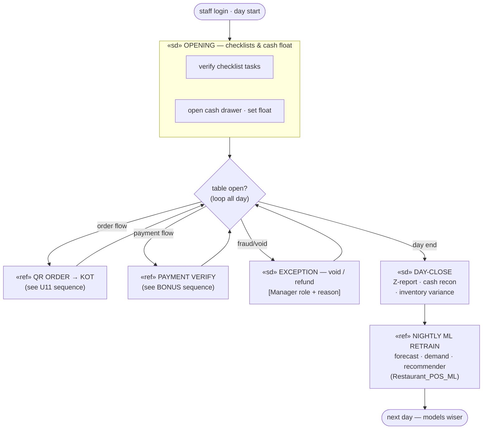
```mermaid
%% U14 — INTERACTION OVERVIEW DIAGRAM (UML 2.5 · Behavioural)
%% An activity diagram whose nodes are whole interactions («sd» frames),
%% showing how a restaurant's service day composes the other diagrams.
flowchart TB
    IO0([staff login · day start]) --> IO1

    subgraph IO1["«sd» OPENING — checklists & cash float"]
        O1["verify checklist tasks"]
        O2["open cash drawer · set float"]
    end

    IO1 --> D1{"table open?<br>(loop all day)"}

    D1 -->|"order flow"| IO3["«ref» QR ORDER → KOT<br>(see U11 sequence)"]
    D1 -->|"payment flow"| IO4["«ref» PAYMENT VERIFY<br>(see BONUS sequence)"]
    D1 -->|"fraud/void"| IO5["«sd» EXCEPTION — void / refund<br>[Manager role + reason]"]

    IO3 --> D1
    IO4 --> D1
    IO5 --> D1

    D1 -->|"day end"| IO6["«sd» DAY-CLOSE<br>Z-report · cash recon<br>· inventory variance"]

    IO6 --> IO7["«ref» NIGHTLY ML RETRAIN<br>forecast · demand · recommender<br>(Restaurant_POS_ML)"]

    IO7 --> IO8(["next day — models wiser"])
```

## Bonus · Sequence Diagram — UPI payment with HMAC verification (behavioural)

The exact Razorpay flow implemented in paymentController.js, plus alt/loop frames for signature mismatch and offline replay.

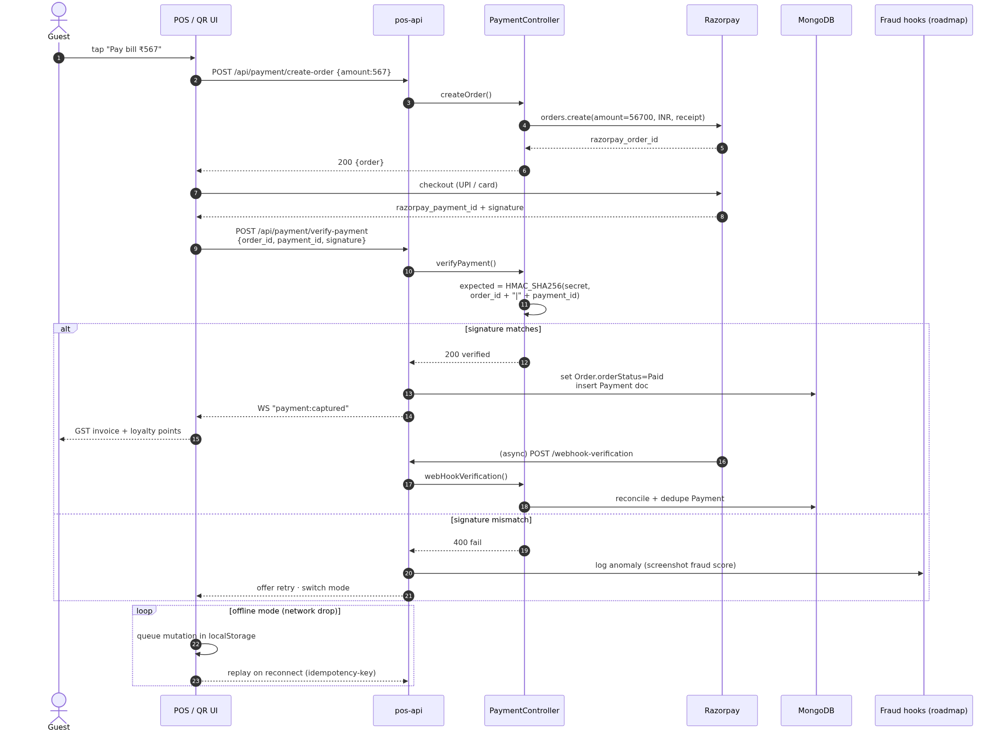

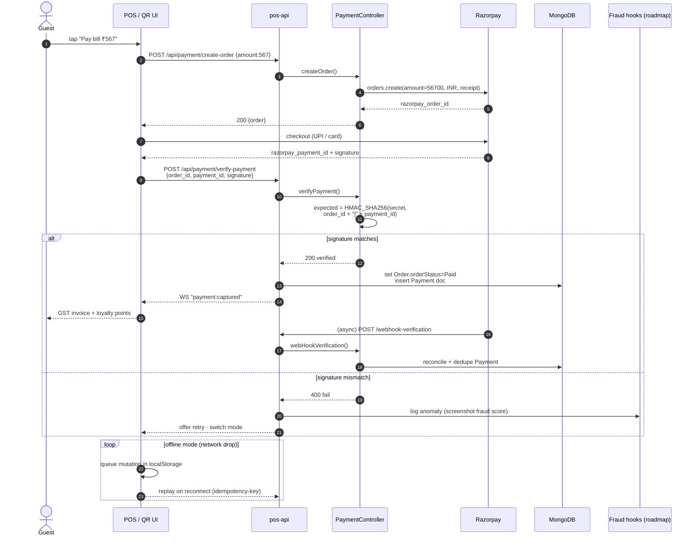
```mermaid
%% U12 — SEQUENCE DIAGRAM #2 (UML 2.5 · Behavioural)
%% "UPI payment with signature verification" — the exact Razorpay flow
%% implemented in paymentController.js, plus the alt/loop frames.
sequenceDiagram
    autonumber
    actor G as Guest
    participant FE as POS / QR UI
    participant API as pos-api
    participant PC as PaymentController
    participant RZ as Razorpay
    participant DB as MongoDB
    participant FR as Fraud hooks (roadmap)

    G->>FE: tap "Pay bill ₹567"
    FE->>API: POST /api/payment/create-order {amount:567}
    API->>PC: createOrder()
    PC->>RZ: orders.create(amount=56700, INR, receipt)
    RZ-->>PC: razorpay_order_id
    PC-->>FE: 200 {order}

    FE->>RZ: checkout (UPI / card)
    RZ-->>FE: razorpay_payment_id + signature
    FE->>API: POST /api/payment/verify-payment<br>{order_id, payment_id, signature}
    API->>PC: verifyPayment()
    PC->>PC: expected = HMAC_SHA256(secret,<br>order_id + "|" + payment_id)

    alt signature matches
        PC-->>API: 200 verified
        API->>DB: set Order.orderStatus=Paid<br>insert Payment doc
        API-->>FE: WS "payment:captured"
        FE-->>G: GST invoice + loyalty points
        RZ->>API: (async) POST /webhook-verification
        API->>PC: webHookVerification()
        PC->>DB: reconcile + dedupe Payment
    else signature mismatch
        PC-->>API: 400 fail
        API->>FR: log anomaly (screenshot fraud score)
        API-->>FE: offer retry · switch mode
    end

    loop offline mode (network drop)
        FE->>FE: queue mutation in localStorage
        FE-->>API: replay on reconnect (idempotency-key)
    end
```
